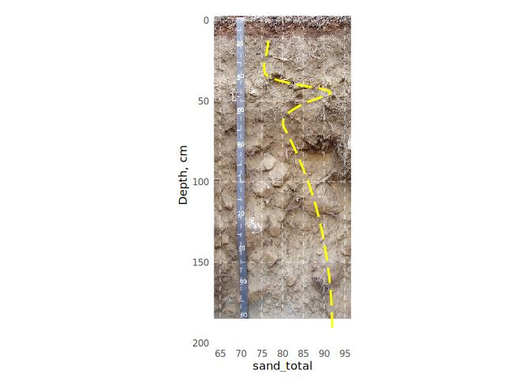

<!-- README.md is generated from README.Rmd. Please edit that file -->

# SoilProfileGraphs

<!-- badges: start -->
<!-- badges: end -->

The goal of SoilProfileGraphs is to provide extensions for ‘aqp’ and
‘ggplot2’ for creation of soil profile-related graphics. The first focus
is on ‘calibrated’ pit photographs with overplotting of soil property
data.

## Installation

You can install the development version of SoilProfileGraphs like so:

``` r
# install.packages("remotes")
remotes::install_github("brownag/SoilProfileGraphs")
```

## Example

This is a basic example which shows you how to solve a common problem:

``` r
library(SoilProfileGraphs)
library(soilDB)

spc <- readRDS(system.file("extdata", "aecpedons.rds",
                           package = "SoilProfileGraphs"))[4, ]
lab <- soilDB::fetchLDM(spc$pedlabsampnum)
#> single result set, returning a data.frame
#> converting profile IDs from integer to character

spg(
  system.file("extdata", "sueredo.png",
              package = "SoilProfileGraphs"),
  spc = lab,
  prop = "sand_total",
  depth_min = -3,
  depth_max = 185,
  prop_min = 65,
  prop_max = 95
)
#> Loading required namespace: mpspline2
#> 2 depth range(s) with missing analytical data removed from 34504.
#> Scale for y is already present.
#> Adding another scale for y, which will replace the existing scale.
#> Scale for y is already present.
#> Adding another scale for y, which will replace the existing scale.
#> Warning: Removed 12 rows containing missing values (`geom_path()`).
```


